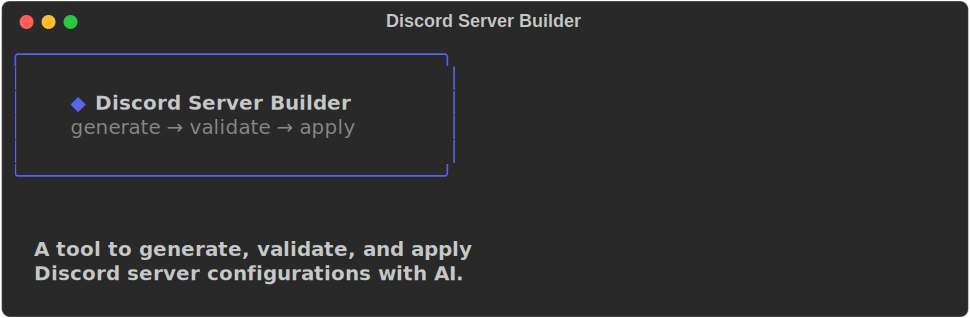
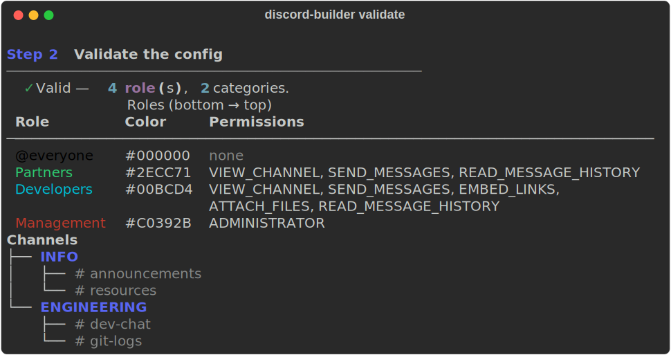
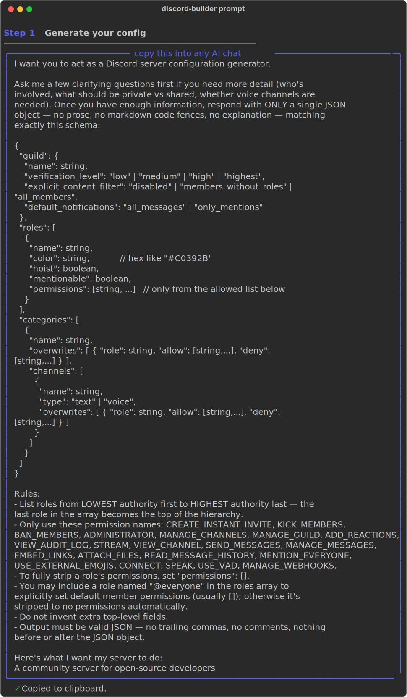

<p align="center">
  
</p>

<p align="center">
  <b>Generate → Validate → Apply</b><br>
  <i>AI-powered Discord server configuration tool</i>
</p>

<p align="center">
  
  
  
  
</p>

---

## Overview

**Discord Server Builder** is a CLI tool that lets you describe your ideal Discord server in plain English, generate a structured JSON config using any AI (ChatGPT, Claude, etc.), validate it against Discord's permission system, and apply it to a live server — all from the terminal.

## Features

| | |
|---|---|
| :speech_balloon: **AI-Powered Config Generation** | Describe your server in plain language. The tool produces a copyable prompt that any LLM can turn into a valid config. |
| :white_check_mark: **Strict Validation** | Checks roles, permissions, channel overwrites against Discord's API schema — catches mistakes before they reach your server. |
| :rocket: **One-Click Apply** | Pushes the full configuration to your Discord server: guild settings, roles (with hierarchy), categories, channels, and permission overwrites. |
| :framed_picture: **Rich Preview** | Uses the `rich` library to render colorful tables of roles and tree views of your channel structure before applying. |
| :mag: **Live Server Inspection** | Read an existing server back out — roles with decoded permissions, channel/category tree with overwrites, plus boosts, features, emojis and member counts — and export it all to a re-appliable JSON config. |
| :shield: **Safe by Default** | Rate-limit aware, confirmation prompts before destructive changes, and full validation before any API calls. |

## How It Works

```
  ┌─────────────┐     ┌──────────────┐     ┌──────────────┐
  │  1. PROMPT  │────▶│  2. PASTE    │────▶│  3. VALIDATE │
  │  "a server  │     │  into any AI │     │  check the   │
  │   for devs" │     │  → get JSON  │     │  JSON config  │
  └─────────────┘     └──────────────┘     └──────┬───────┘
                                                  │
                                          ┌───────▼───────┐
                                          │  4. APPLY     │
                                          │  to Discord   │
                                          └───────────────┘
```

## Screenshots

### Validate a Config

Validating a server config shows a roles table (color-coded, bottom→top hierarchy) and a channel tree:

<p align="center">
  
</p>

### Generate an AI Prompt

Describe what you want, and the tool builds a structured prompt you can paste into any AI chat:

<p align="center">
  
</p>

## Installation

```bash
# 1. Clone the repo
git clone https://github.com/yourusername/discord-server-builder
cd discord-server-builder

# 2. Install dependencies
pip install -r requirements.txt

# 3. Set up your bot credentials
echo "DISCORD_BOT_TOKEN=your-bot-token" >> .env
echo "DISCORD_GUILD_ID=your-server-id"  >> .env
```

> **Need a bot token?** Create an application at https://discord.com/developers/applications, add a bot, and enable the necessary intents. The bot needs `MANAGE_GUILD`, `MANAGE_ROLES`, `MANAGE_CHANNELS`, and `MANAGE_WEBHOOKS` permissions.

## Usage

### Interactive Mode

```bash
python discord_builder.py
```

Opens a menu where you can choose between `prompt`, `validate`, `apply`, `inspect`, and `exit`.

### Commands

```bash
# Generate an AI prompt
python discord_builder.py prompt "A community for open-source developers"
# Optionally save the prompt to a file:
python discord_builder.py prompt "My server" --save prompt.txt

# Validate a JSON config
python discord_builder.py validate example_config.json
# Or pipe it in:
cat config.json | python discord_builder.py validate -

# Apply to Discord (requires .env with bot token and guild ID)
python discord_builder.py apply config.json
# Skip the confirmation prompt:
python discord_builder.py apply config.json -y

# Inspect a live server (uses DISCORD_GUILD_ID from .env, or pass an ID)
python discord_builder.py inspect
python discord_builder.py inspect 123456789012345678
# Export the whole server to a re-appliable JSON config:
python discord_builder.py inspect --json my_server.json
```

### Inspecting an Existing Server

`inspect` is the read-only mirror of `apply` — instead of pushing a config to
Discord, it pulls the current state of a live server back out so you can see
exactly what's there and capture maximal context:

- **Server summary** — name, description, member/online counts, verification
  level, content filter, notification defaults, boost tier, boost count,
  emoji/sticker counts, and enabled guild features.
- **Roles table** — every role top→bottom with its color, `hoist`/`mentionable`
  flags, whether it's bot-`managed`, and its full decoded permission list
  (`ADMINISTRATOR` is highlighted since it grants everything).
- **Channel tree** — categories and their channels (text/voice/announcement/
  stage/forum) with a compact `+allow / -deny` summary of each role overwrite;
  channels with no category are grouped separately and threads are skipped.

With `--json`, the entire server is exported to a config that plugs straight
back into `validate` and `apply`, plus a read-only `meta` block holding the
extra context (guild ID, member counts, boosts, features, channel-type
breakdown) that `apply` doesn't set. Handy for backing up a server, cloning it,
or diffing what's live against what you intend to apply.

> The bot only needs to be a member of the server with `View Channels` /
> `Manage Roles` to inspect it — no destructive permissions required.

## Config Format

The config JSON describes your entire server in three sections:

### `guild`

Server-level settings — name, verification level, content filter, and notification defaults.

```json
{
  "guild": {
    "name": "My Server",
    "verification_level": "medium",
    "explicit_content_filter": "all_members",
    "default_notifications": "only_mentions"
  }
}
```

### `roles`

An ordered array from **lowest authority to highest**. The last role becomes the top of the hierarchy. Each role has:

| Field | Type | Description |
|---|---|---|
| `name` | string | Role name |
| `color` | hex string | Role color (e.g. `"#C0392B"`) |
| `hoist` | boolean | Show members separately in the sidebar |
| `mentionable` | boolean | Allow @mentions from anyone |
| `permissions` | string[] | Permission flags from Discord's API |

```json
{
  "roles": [
    { "name": "@everyone", "color": "#000000", "hoist": false, "mentionable": false, "permissions": [] },
    { "name": "Members", "color": "#2ECC71", "hoist": false, "mentionable": false, "permissions": ["VIEW_CHANNEL", "SEND_MESSAGES"] },
    { "name": "Admin", "color": "#E74C3C", "hoist": true, "mentionable": true, "permissions": ["ADMINISTRATOR"] }
  ]
}
```

### `categories`

Channel groups. Each category can have its own role overwrites (applied to all child channels) and a list of channels.

```json
{
  "categories": [
    {
      "name": "ENGINEERING",
      "overwrites": [
        { "role": "Member", "allow": ["VIEW_CHANNEL"], "deny": ["SEND_MESSAGES"] }
      ],
      "channels": [
        { "name": "dev-chat", "type": "text", "overwrites": [] },
        { "name": "voice-chat", "type": "voice", "overwrites": [] }
      ]
    }
  ]
}
```

See [`example_config.json`](example_config.json) for a complete, well-documented example.

## Complete Example Workflow

```bash
# Step 1: Generate a prompt
python discord_builder.py prompt "A Discord server for a game development studio with separate channels for artists, programmers, and producers"

# Step 2: Paste the prompt into ChatGPT/Claude, get back a JSON config, save it as my_server.json

# Step 3: Validate it
python discord_builder.py validate my_server.json

# Step 4: Apply to your server
python discord_builder.py apply my_server.json
```

## Project Structure

```
.
├── discord_builder.py    # Main CLI tool
├── example_config.json   # Example configuration with comments
├── config.json           # Your configuration (gitignored)
├── requirements.txt      # Python dependencies
├── .env                  # Bot credentials (gitignored)
├── assets/               # SVG screenshots for README
│   ├── banner.svg
│   ├── validate.svg
│   ├── validate_demo.svg
│   └── prompt.svg
└── scripts/
    └── capture_svgs.py   # Script to regenerate README screenshots
```


## License

MIT
